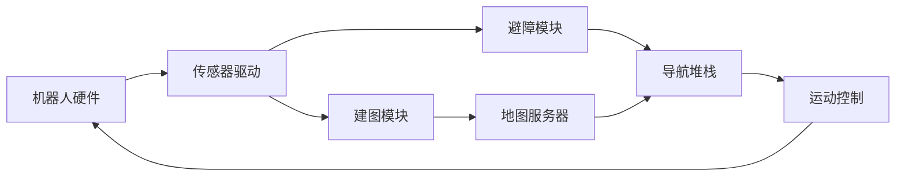

# XUD_ROS智能导航小车项目

> 基于冰达NanoRobot_Pro的ros小车项目。

## 项目概述

这个开源项目提供了一个完整的ROS机器人实现方案，基于冰达NanoRobot_Pro。项目集成了SLAM建图、自主导航和动态避障功能，以及实现了多机协作功能。

  
*(注：实际项目中请替换为真实演示GIF)*

## 核心功能

- **实时建图 (SLAM)**
  - 支持 gmapping 和 cartographer 算法
  - 生成高质量2D占用栅格地图
  - 地图自动保存与加载功能
- **精准导航**
  - 全局路径规划（A*, Dijkstra）
  - 局部路径规划（TEB, DWA）
  - 自适应蒙特卡洛定位（AMCL）
- **智能避障**
  - 多传感器融合（激光雷达+深度相机）
- **可视化工具**
  - RViz实时监控
  - 导航调试工具

## 系统架构



## 安装指南

### 系统要求
- **Ubuntu** 20.04 LTS
- **ROS** Noetic
- **Python** 3.8+

### 安装步骤

1. **安装ROS框架**
```bash
sudo apt install ros-noetic-desktop-full
echo "source /opt/ros/noetic/setup.bash" >> ~/.bashrc
source ~/.bashrc
```

2. **创建ROS工作空间**
```bash
mkdir -p ~/catkin_ws/src
cd ~/catkin_ws
catkin_make
```

3. **安装项目依赖**
```bash
sudo apt install ros-noetic-navigation \
ros-noetic-slam-gmapping \
```

4. **克隆本项目**
```bash
cd ~/nav_ws/src
git clone https://github.com/yourusername/ros-navigation-bot.git
cd ..
rosdep install --from-paths src --ignore-src -r -y
```

5. **编译项目**
```bash
catkin_make
source devel/setup.bash
```

## 使用说明

### 基础操作

1. **启动机器人基础功能**
```bash
roslaunch nav_bot bringup.launch
```

2. **建图模式**
```bash
roslaunch nav_bot slam.launch mapper:=gmapping
# 使用遥控器或网页界面控制机器人移动完成建图
# 保存地图：rosrun map_server map_saver -f ~/my_map
```

3. **导航模式**
```bash
roslaunch nav_bot navigation.launch map_file:=/path/to/my_map.yaml
# 在RViz中设置目标点
```

4. **自主避障演示**
```bash
roslaunch nav_bot autonomous_nav.launch
```

### 高级功能

- **多目标点巡逻**：
  ```bash
  rosrun nav_bot waypoint_patrol.py _points:="[x1,y1], [x2,y2]"
  ```
  
- **动态避障测试**：
  ```bash
  roslaunch nav_bot obstacle_test.launch
  ```

- **性能监控**：
  ```bash
  roslaunch nav_bot performance_monitor.launch
  ```

## 项目结构

```
ros-navigation-bot/
├── config/             # 参数配置文件
│   ├── costmaps/       # 代价地图配置
│   ├── planners/       # 路径规划器配置
│   └── sensors/        # 传感器配置
├── launch/             # 启动文件
│   ├── bringup.launch
│   ├── navigation.launch
│   └── slam.launch
├── maps/               # 存储地图文件
├── scripts/            # Python工具脚本
├── src/                # C++源文件
│   ├── controllers/    # 运动控制器
│   └── utils/          # 实用工具类
├── urdf/               # 机器人模型
├── worlds/             # Gazebo仿真环境
├── CMakeLists.txt
├── package.xml
└── README.md
```

## 自定义配置

### 修改导航参数
编辑 `config/navigation/costmap_common_params.yaml`：
```yaml
obstacle_range: 2.5     # 障碍物检测范围
raytrace_range: 3.0      # 光线追踪范围
inflation_radius: 0.3    # 膨胀半径
```

### 添加新传感器
1. 在 `config/sensors` 中创建新配置文件
2. 更新 `launch/bringup.launch` 包含传感器驱动
3. 修改 `costmap_params.yaml` 添加传感器层

## 贡献指南

欢迎通过以下方式参与贡献：
1. 提交Issue报告问题或建议
2. Fork项目并提交Pull Request
3. 完善项目文档
4. 添加新功能模块

贡献前请阅读：
- [ROS编码规范](http://wiki.ros.org/StyleGuide)
- [项目开发路线图](docs/ROADMAP.md)

## 许可协议

本项目采用 **Apache License 2.0**
```
Copyright 2023 Your Name

Licensed under the Apache License, Version 2.0 (the "License");
you may not use this file except in compliance with the License.
You may obtain a copy of the License at

    http://www.apache.org/licenses/LICENSE-2.0

Unless required by applicable law or agreed to in writing, software
distributed under the License is distributed on an "AS IS" BASIS,
WITHOUT WARRANTIES OR CONDITIONS OF ANY KIND, either express or implied.
See the License for the specific language governing permissions and
limitations under the License.
```

## 技术支持

如需技术支持，请通过以下方式联系：
- 项目讨论区：[GitHub Discussions](https://github.com/yourusername/ros-navigation-bot/discussions)
- 邮件支持：support@yourproject.org
- 社区论坛：[ROS Discourse](https://discourse.ros.org/)

---

**让机器人导航更智能，让开发更简单** - 欢迎加入开发社区！
